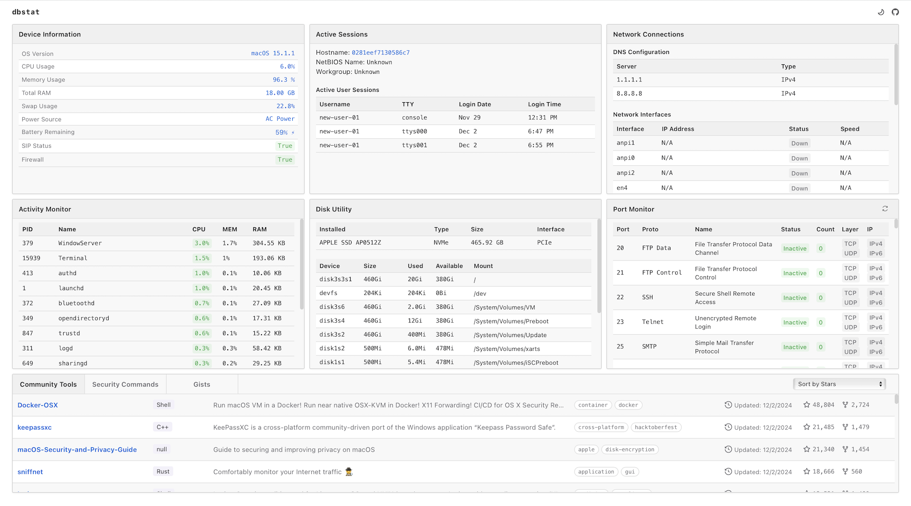
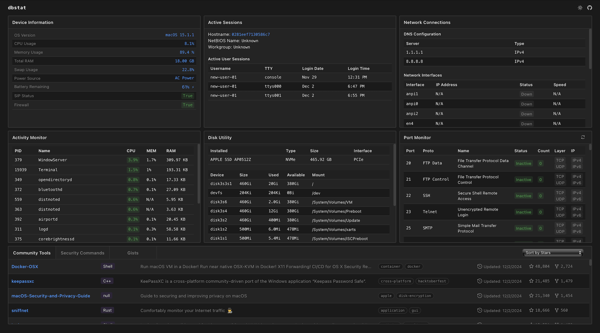

## dbstat (macOS 13.0+)
Simple forensics dashboard for monitoring real time metrics  Mac., in . 
This project is provided as a free resource and community contributions are always welcome. New to Git? First time committers are encouraged.

### Requirements:
- **Node.js**: 16+  
- **macOS**: 11.0+ (Big Sur or later)
- **Browser**: ✅ Safari / ✅ Firefox (I only tested these 2 but any modern browser should work)

### Real-time metrics supported (more will be added)
- Network
- Port watcher
- Running processes
- Storage analytics  
- Logged-in sessions
- And many more!

Additional features include...
- Dark/light themes
- GitHub integration
- Open AI API support (optional) 

### 
  
*Light Theme*

  
*Dark Theme*

### Dependencies
- express `[4.17.1]`  
- socket.io `[4.8.1]`  
- systeminformation `[5.11.9]`  
- jsonwebtoken `[9.0.2]`  
- helmet `[8.0.0]`  
- dotenv `[16.0.0]` 

### Installation

```bash
git clone https://github.com/cgtwig/dbstat
cd dbstat
```
1. **Clone repo and go inside project folder**

```
npm install
```
2. **Install required dependencies**

```bash
# Server configuration
PORT=3000
HOST=127.0.0.1
CORS_ORIGIN=http://127.0.0.1:3000

# (REQUIRED) Replace `insert-here` using the terminal command provided in README.md
JWT_SECRET=insert-token-here

# (OPTIONAL) Security command generation test feature
# OPENAI_API_KEY=your-api-key
```
3. **Rename `.env-example` to `.env` and replace `JWT_SECRET` value using the command below**
```bash
node -e "console.log(require('crypto').randomBytes(32).toString('hex'))"
```
Generates a JWT token using terminal

4. **Open AI API setup (OPTIONAL) This is disabled by default. To keep it disabled, you can skip this step and go to step 5**
This is a test feature  - The Open AI API is used for generating example terminal commands that can offer some help during forensic workflows. 
How to enable: 
- Find the last line in your `.env` file. It should look like this `# OPENAI_API_KEY=your-api-key`
- Remove the `#` at the beginning of the line
- Finally, replace `your-api-key` with your real Open AI API key
**Note**: If enabled, 1 API call is made using the model `gpt-4o-mini` (Cost = less than $.01?). ALso...clicking the 'regenerate' wilew API request each time it's clicked.

5. **Start app**

```bash
npm start
```
The server should now be running. To access, visit `http://localhost:3000` in your browser.  

- If you experience a problem using the app, or would like to request new feature - please let us know over in the issues area.

### License
This project is licensed under the MIT License and is **open source**. Contributions are welcome!

#macosx #dashboard #blueteam #forensics #monitoring #metrics #networking #tracking #analytics #security #nodejs #spa #websocket #stats #data
